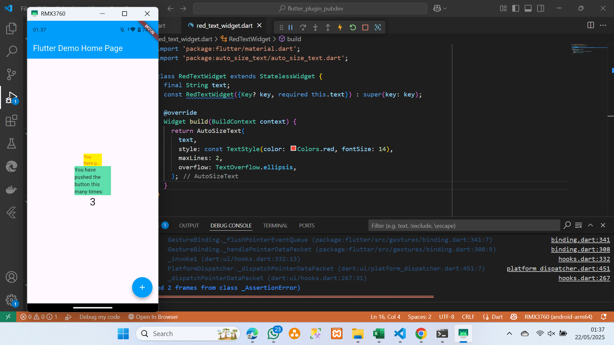

# flutter_plugin_pubdev

A new Flutter project.

## Getting Started

# Penjelasan langkah ke 2

Tujuan dari langkah ke dua itu harus memasukan code tersebut, Di dalam terminal pada vscode yang
berfungsi untuk memasukan plugin ke project yang kita buat.

# Error langkah 4
Di langkah 4, error terjadi pada langkah tersebut karna kita baru menambahkan plugin melalui terminal namun peligin belum dipanggil kedalam file kode yang menginstance classnya.

### Penjelasan Langkah 5

Pada langkah ini kita membuat properti text pada class RedTextWidget yang sudah di buat dan membuat request pada constructor agar saat kita membuat object / menginstance class tersebut kita harus memasukan parameter type string yang nantinya dimasukan pada variable text dan digunakan di dalam classnya.

## Penjelasan Parameter dalam autosizetext

| Parameter             | Deskripsi                                                                 |
|-----------------------|---------------------------------------------------------------------------|
| `text`                | Teks yang akan ditampilkan.                                               |
| `style`               | Gaya teks (warna, ukuran font, ketebalan, dll).                           |
| `minFontSize`         | Ukuran font minimum agar teks tetap bisa dibaca jika harus diperkecil.   |
| `maxFontSize`         | Ukuran font maksimum (default sangat besar: 1000).                        |
| `maxLines`            | Jumlah maksimum baris yang boleh digunakan.                              |
| `overflow`            | Mengatur perilaku jika teks masih tidak muat, misalnya `ellipsis`.       |
| `presetFontSizes`     | Daftar ukuran font yang dicoba satu per satu (dari besar ke kecil).      |
| `stepGranularity`     | Jarak perubahan ukuran font saat menyesuaikan. Default: `1.0`.           |
| `textAlign`           | Posisi teks: kiri, tengah, kanan, dll.                                   |
| `softWrap`            | Apakah teks boleh membungkus ke baris baru.                              |
| `overflowReplacement` | Widget pengganti jika teks tidak muat sama sekali.                       |
| `wrapWords`           | Apakah kata boleh dipisah dan dibungkus.                                 |
| `group`               | Digunakan untuk menyamakan ukuran font beberapa `AutoSizeText` sekaligus.|

### Penjelasan Langkah 6

Pada langkah ini kita menambahkan dua widget container yang memiliki child sebetulnya text perbedaan utamanya yang pertama kita membuat textnya dengan RedTextWidget yang kita buat hal ini memungkinkan text menjadi auto size menyesuaikan seberapa ukuran dari containernya, dan memotong teks jika terlalu panjang. 

Sedangkan yang kedua kita hanya menggunakan widget text biasa, maka jika tidak dikelola lebih lanjut ujuran text akan mengikuti bawaan dari flutter, Jika teks terlalu panjang dan tidak muat dalam lebar container, teks bisa meluap atau terpotong secara default, tergantung pengaturan.
